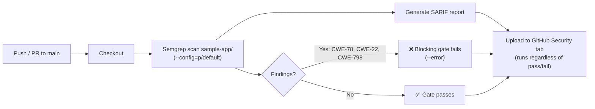
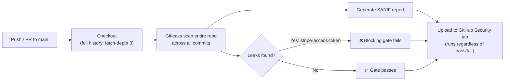
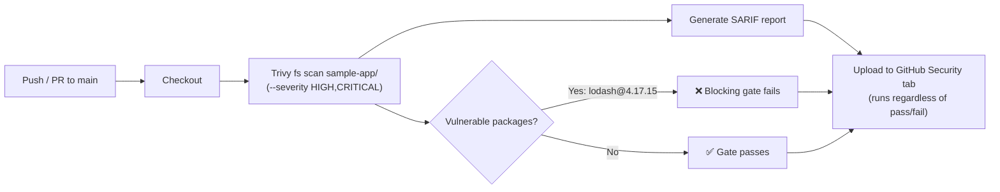
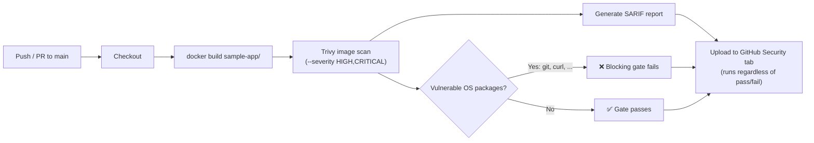
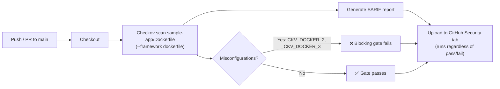

# devsecops

A hands-on portfolio repo for practicing **DevOps + Security** skills for job-seeking purposes — CI/CD pipelines, automation, and security tooling built the way a DevSecOps engineer would integrate them, not just security scripts in isolation. Each feature below is a small, self-contained demonstration of one piece of that stack — DevOps-side (pipelines, IaC, containers, deployment automation) and security-side (SAST, SCA, secrets detection, and the rest of the "shift-left" toolchain) alike.

## Terminology

Terms used throughout this README, for readers newer to the DevSecOps space:

- **DevSecOps** — building security checks directly into DevOps pipelines, so vulnerabilities are caught as code is written and shipped rather than in a separate audit after the fact.
- **CI/CD (Continuous Integration / Continuous Delivery)** — automatically building, testing, and (optionally) deploying code on every push or pull request, instead of doing those steps by hand.
- **Shift-left** — moving security checks earlier ("left") in the development timeline — into the pipeline itself — instead of leaving them until just before release.
- **Gate** — a pipeline step that can block a push or PR from passing CI when it fails, as opposed to a check that only reports findings without stopping anything.
- **SAST (Static Application Security Testing)** — scanning source code itself, without running it, to find vulnerability patterns like injection flaws or hardcoded secrets. Used by the [SAST Security Gate](#1-sast-security-gate).
- **SCA (Software Composition Analysis)** — scanning third-party dependencies (npm packages, in this repo) against known-vulnerability databases, rather than analyzing code you wrote yourself. Used by the [SCA Dependency Scanning Gate](#3-sca-dependency-scanning-gate).
- **Secrets detection** — scanning for credentials (API keys, tokens, passwords) accidentally committed to a repo, including ones buried in git history rather than the current files. Used by the [Secrets Detection Gate](#2-secrets-detection-gate).
- **SARIF (Static Analysis Results Interchange Format)** — a standard JSON format for static analysis findings, which is what lets Semgrep, Gitleaks, and Trivy all publish to GitHub's Security tab in the same way.
- **CWE (Common Weakness Enumeration)** — a standardized ID for a *class* of vulnerability, e.g. CWE-78 for OS command injection.
- **CVE (Common Vulnerabilities and Exposures)** — a standardized ID for a *specific, known* vulnerability, usually in a specific version of a specific package, e.g. CVE-2020-8203.
- **Container image scanning** — scanning a fully *built* container image rather than just an application's own dependency lockfile. This covers the base OS layer (e.g. the Debian or Alpine packages shipped underneath your application code) — an attack surface neither SAST nor SCA can see, since it isn't source code or an npm dependency. Used by the [Container Image Scanning Gate](#4-container-image-scanning-gate).
- **IaC (Infrastructure as Code)** — defining infrastructure (servers, containers, cloud resources) in version-controlled config files instead of provisioning it by hand. Misconfigurations in these files (e.g. a Dockerfile) are caught by the [IaC Misconfiguration Scanning Gate](#5-iac-misconfiguration-scanning-gate).

## Features

### 1. SAST Security Gate

A GitHub Actions pipeline ([`.github/workflows/sast.yml`](.github/workflows/sast.yml)) runs [Semgrep](https://semgrep.dev/) against [`sample-app/`](sample-app/) — a small Express + TypeScript service — on every push to `main` and every pull request. This demonstrates the CI/CD side as much as the security side: the scan is just another gated step in the same pipeline that would run builds, tests, and deploys, not a separate bolt-on process.



**Note:** `sample-app/` is *intentionally* vulnerable. It seeds three well-known vulnerability classes on purpose, so the pipeline has real findings to catch:

| Route / file | Vulnerability | CWE |
|---|---|---|
| `GET /run?cmd=` | OS command injection | CWE-78 |
| `GET /file?name=` | Path traversal | CWE-22 |
| `src/config.ts` | Hardcoded credential | CWE-798 |

Because of this, **CI on `main` is expected to fail** — that's the point. It proves the security gate actually blocks insecure code rather than silently logging it. Check the failed [Actions run](../../actions) for Semgrep's annotated findings, or the [Security tab](../../security/code-scanning) for the same findings published as GitHub code scanning alerts (SARIF).

#### Running it locally

```bash
cd sample-app
npm install
npm test          # runs the app's own test suite (vitest)
pipx install semgrep   # if you don't already have it (or: pip install --user semgrep)
semgrep scan . --config=p/default
```

### 2. Secrets Detection Gate

A second GitHub Actions pipeline ([`.github/workflows/secrets-scan.yml`](.github/workflows/secrets-scan.yml)) runs [Gitleaks](https://github.com/gitleaks/gitleaks) across the repo's **full git history** — not just the current files — on every push to `main` and every pull request. This catches a class of leak the SAST gate can't: a credential that was committed and later deleted or rotated still shows up, because Gitleaks scans every commit's diff, not just the working tree at HEAD.



**Note:** this reuses the same seeded credential the SAST gate already catches — no second fake secret was added. It doubles as a demonstration that one intentional vulnerability can be (and, in a real pipeline, should be) caught by more than one class of tool:

| File | Vulnerability | Detected by |
|---|---|---|
| `sample-app/src/config.ts` | Hardcoded Stripe-shaped credential (CWE-798) | Gitleaks `stripe-access-token` rule |

#### Running it locally

```bash
docker run --rm -v "$(pwd)":/repo -w /repo zricethezav/gitleaks:v8.30.1 git .
```

### 3. SCA Dependency Scanning Gate

A third GitHub Actions pipeline ([`.github/workflows/sca-scan.yml`](.github/workflows/sca-scan.yml)) runs [Trivy](https://trivy.dev/) against `sample-app/`'s npm lockfile on every push to `main` and every pull request. This is the "software composition analysis" leg of the shift-left toolchain: it catches known-vulnerable *third-party* packages, a class of risk neither the SAST gate (which analyzes code you wrote) nor the secrets gate (which looks for leaked credentials) covers.



**Note:** `sample-app` pins `lodash@4.17.15` — a real, deliberately outdated dependency, not a fabricated finding — as the demo target:

| Package | Vulnerability | CVE | Severity |
|---|---|---|---|
| `lodash@4.17.15` | Prototype pollution in `zipObjectDeep` | CVE-2020-8203 | HIGH |
| `lodash@4.17.15` | Command injection via template | CVE-2021-23337 | HIGH |
| `lodash@4.17.15` | Arbitrary code execution via untrusted input in template imports | CVE-2026-4800 | HIGH |
| `lodash@4.17.15` | Allocation of resources without limits or throttling | NSWG-ECO-516 | HIGH |

#### Running it locally

```bash
docker run --rm -v "$(pwd)":/repo aquasec/trivy:0.70.0 fs --scanners vuln --severity HIGH,CRITICAL /repo
```

### 4. Container Image Scanning Gate

A fourth GitHub Actions pipeline ([`.github/workflows/container-scan.yml`](.github/workflows/container-scan.yml)) builds [`sample-app/Dockerfile`](sample-app/Dockerfile) into a container image and runs [Trivy](https://trivy.dev/) against the *built image* — not just its source or lockfile — on every push to `main` and every pull request. This is the container leg of the shift-left toolchain: it catches known vulnerabilities in the base OS layer that ships underneath the application, a class of risk the SCA gate above can't see because it only scans `sample-app`'s npm lockfile, not the operating system packages a container actually ships with at runtime.



**Note:** [`sample-app/Dockerfile`](sample-app/Dockerfile) pins `FROM node:22.0.0` — a real, unmodified Docker Hub image, not a fabricated finding — as the demo target. Its OS layer (Debian 12.5, as shipped in that tag) is old enough that Trivy's image scan finds **2,588** known OS-package vulnerabilities at scan time (2,344 HIGH, 244 CRITICAL) — far too many for one table, so here's a representative sample:

| Package (OS layer) | Vulnerability | CVE | Severity |
|---|---|---|---|
| `git` | Remote code execution via recursive clone | CVE-2024-32002 | CRITICAL |
| `curl` | Wrong file transfer due to incorrect SMB connection reuse | CVE-2026-5773 | HIGH |
| `bsdutils` (util-linux) | TOCTOU race in the `mount` program via ancestor directory swap | CVE-2026-53613 | HIGH |
| `dirmngr` (GnuPG) | Information disclosure and potential arbitrary code execution via out-of-bounds write | CVE-2025-68973 | HIGH |

The image scan also re-detects the same seeded `lodash@4.17.15` CVEs the SCA gate already catches, since building the image installs the same npm dependencies — that's expected, not a bug: scanning a built artifact naturally re-surfaces application-layer findings too, on top of the OS-layer ones that are unique to this gate. Because both gates use Trivy, each uploads its SARIF under a distinct category (`trivy-fs` vs. `trivy-image`) so the Security tab shows both sets of findings instead of one overwriting the other.

#### Running it locally

```bash
cd sample-app
docker build -t sample-app:local .
docker run --rm -v /var/run/docker.sock:/var/run/docker.sock aquasec/trivy:0.70.0 image --scanners vuln --severity HIGH,CRITICAL sample-app:local
```

### 5. IaC Misconfiguration Scanning Gate

A fifth GitHub Actions pipeline ([`.github/workflows/iac-scan.yml`](.github/workflows/iac-scan.yml)) runs [Checkov](https://www.checkov.io/) against [`sample-app/Dockerfile`](sample-app/Dockerfile) on every push to `main` and every pull request. This is the "infrastructure as code" leg of the shift-left toolchain: it catches insecure *configuration* of infrastructure definitions themselves — before an image is even built — a class of risk none of the other four gates cover, since they analyze application code, dependencies, and the built artifact rather than how that artifact is defined.



**Note:** [`sample-app/Dockerfile`](sample-app/Dockerfile) is scanned as-is — no misconfiguration was added for this demo. It already fails 2 of 42 Dockerfile checks, real gaps rather than a fabricated finding:

| Check | Misconfiguration | Checkov ID |
|---|---|---|
| Missing healthcheck | No `HEALTHCHECK` instruction, so an unresponsive container can't be detected and restarted automatically | `CKV_DOCKER_2` |
| Running as root | No `USER` instruction, so the container runs as root by default | `CKV_DOCKER_3` |

Because of this, **CI on `main` is expected to fail for all five gates** — that's the point of this repo. Check the failed [Actions runs](../../actions) for any pipeline's annotated findings, or the [Security tab](../../security/code-scanning) for the combined findings from all five, published as GitHub code scanning alerts (SARIF).

#### Running it locally

```bash
docker run --rm -v "$(pwd)/sample-app":/tf ghcr.io/bridgecrewio/checkov:3.3.16 -d /tf --framework dockerfile --compact
```

_More features (CI/CD pipelines) will be added here as this repo grows._
