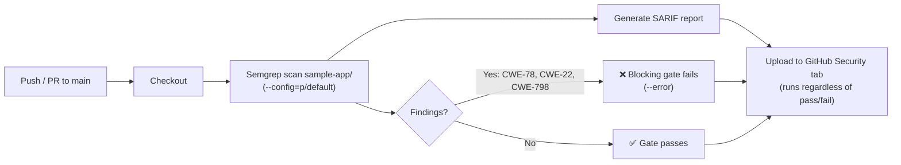
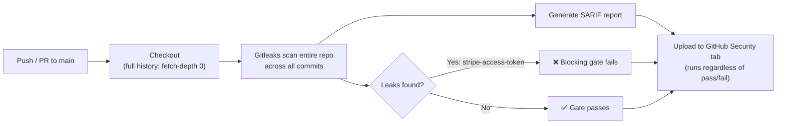

# devsecops

A hands-on portfolio repo for practicing **DevOps + Security** skills for job-seeking purposes — CI/CD pipelines, automation, and security tooling built the way a DevSecOps engineer would integrate them, not just security scripts in isolation. Each feature below is a small, self-contained demonstration of one piece of that stack — DevOps-side (pipelines, IaC, containers, deployment automation) and security-side (SAST, SCA, secrets detection, and the rest of the "shift-left" toolchain) alike.

## Features

### 1. SAST Security Gate

A GitHub Actions pipeline ([`.github/workflows/sast.yml`](.github/workflows/sast.yml)) runs [Semgrep](https://semgrep.dev/) against [`sample-app/`](sample-app/) — a small Express + TypeScript service — on every push to `main` and every pull request. This demonstrates the CI/CD side as much as the security side: the scan is just another gated step in the same pipeline that would run builds, tests, and deploys, not a separate bolt-on process.



**Note:** `sample-app/` is *intentionally* vulnerable. It seeds three well-known vulnerability classes on purpose, so the pipeline has real findings to catch:

| Route / file | Vulnerability | CWE |
|---|---|---|
| `GET /run?cmd=` | OS command injection | CWE-78 |
| `GET /file?name=` | Path traversal | CWE-22 |
| `src/config.ts` | Hardcoded credential | CWE-798 |

Because of this, **CI on `main` is expected to fail** — that's the point. It proves the security gate actually blocks insecure code rather than silently logging it. Check the failed [Actions run](../../actions) for Semgrep's annotated findings, or the [Security tab](../../security/code-scanning) for the same findings published as GitHub code scanning alerts (SARIF).

#### Running it locally

```bash
cd sample-app
npm install
npm test          # runs the app's own test suite (vitest)
pipx install semgrep   # if you don't already have it (or: pip install --user semgrep)
semgrep scan . --config=p/default
```

### 2. Secrets Detection Gate

A second GitHub Actions pipeline ([`.github/workflows/secrets-scan.yml`](.github/workflows/secrets-scan.yml)) runs [Gitleaks](https://github.com/gitleaks/gitleaks) across the repo's **full git history** — not just the current files — on every push to `main` and every pull request. This catches a class of leak the SAST gate can't: a credential that was committed and later deleted or rotated still shows up, because Gitleaks scans every commit's diff, not just the working tree at HEAD.



**Note:** this reuses the same seeded credential the SAST gate already catches — no second fake secret was added. It doubles as a demonstration that one intentional vulnerability can be (and, in a real pipeline, should be) caught by more than one class of tool:

| File | Vulnerability | Detected by |
|---|---|---|
| `sample-app/src/config.ts` | Hardcoded Stripe-shaped credential (CWE-798) | Gitleaks `stripe-access-token` rule |

Because of this, **CI on `main` is expected to fail for both gates** — that's the point of this repo. Check the failed [Actions runs](../../actions) for either pipeline's annotated findings, or the [Security tab](../../security/code-scanning) for the combined findings from both, published as GitHub code scanning alerts (SARIF).

#### Running it locally

```bash
docker run --rm -v "$(pwd)":/repo -w /repo zricethezav/gitleaks:v8.30.1 git .
```

_More features (CI/CD pipelines, IaC, containers, additional scanners) will be added here as this repo grows._
