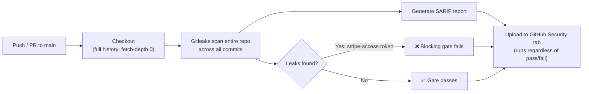
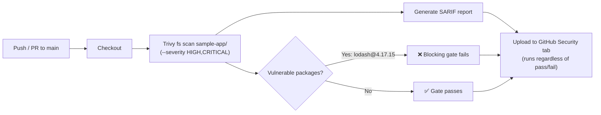

# SCA Dependency Scanning Gate Implementation Plan

> **For agentic workers:** REQUIRED SUB-SKILL: Use superpowers:subagent-driven-development (recommended) or superpowers:executing-plans to implement this plan task-by-task. Steps use checkbox (`- [ ]`) syntax for tracking.

**Goal:** Add a GitHub Actions SCA (software composition analysis) pipeline that scans `sample-app/`'s npm dependencies with Trivy, blocking the build on known-vulnerable packages and publishing findings to GitHub's Security tab — the third gate in this repo's shift-left demo, alongside SAST and secrets detection.

**Architecture:** `sample-app` gets one deliberately outdated, known-vulnerable dependency (`lodash@4.17.15`, CVE-2020-8203 and others), referenced trivially from `app.ts` so it's genuinely exercised rather than just declared. A `.github/workflows/sca-scan.yml` workflow runs Trivy's filesystem scanner against `sample-app/`'s lockfile on every push/PR, fails the job on `HIGH`/`CRITICAL` findings, and separately uploads a SARIF report so the same findings appear under the repo's Security tab — mirroring the two existing gates' shape.

**Tech Stack:** Node.js, TypeScript, Express, Vitest + Supertest (tests), lodash (seeded vulnerable dependency), Trivy via `aquasecurity/trivy-action` (SCA), GitHub Actions.

**Spec:** `docs/superpowers/specs/2026-08-30-sca-dependency-scanning-design.md`

## Global Constraints

- SCA only — no container image scanning, IaC scanning, or DAST in this feature (explicitly deferred per spec's Non-goals).
- The seeded `lodash@4.17.15` dependency must stay pinned to that exact vulnerable version and must never be upgraded or removed — it's the demo finding, the same way `sample-app`'s SAST/secrets vulnerabilities stay in place.
- Scan is filtered to `HIGH,CRITICAL` severity only, to keep the gate's failure attributable to the one seeded package.
- CI on `main` is expected to fail once the workflow is live, same as the other two gates — this is correct behavior, not a bug to chase.
- The repo (`git@github.com:jgyy/devsecops.git`) is public — SARIF→Security tab upload relies on that for free code scanning.
- `git push` (or any action touching the GitHub remote) requires explicit user confirmation before running — never push automatically, even mid-plan.

---

### Task 1: Seed the vulnerable lodash dependency

**Files:**
- Modify: `sample-app/package.json`
- Modify: `sample-app/package-lock.json` (regenerated by `npm install`)
- Modify: `sample-app/src/app.ts`
- Test: `sample-app/src/app.test.ts`

**Interfaces:**
- Consumes: `app` from `./app` (already exists), unchanged shape.
- Produces: `bootInfo` — a `Record<string, string>`, exported from `sample-app/src/app.ts` (`export const bootInfo = zipObjectDeep(...)`). No later task consumes this; it exists solely so the vulnerable dependency is genuinely exercised, not just declared in `package.json`.

- [ ] **Step 1: Add the failing test for `bootInfo`**

Edit `sample-app/src/app.test.ts`, replace the import block:
```ts
import { describe, it, expect } from "vitest";
import request from "supertest";
import { app } from "./app";
import { STRIPE_API_KEY } from "./config";
```
with:
```ts
import { describe, it, expect } from "vitest";
import request from "supertest";
import { app, bootInfo } from "./app";
import { STRIPE_API_KEY } from "./config";
```

Then replace the end of the file:
```ts
describe("config", () => {
  it("exposes a Stripe API key in the expected format", () => {
    expect(STRIPE_API_KEY).toMatch(/^sk_live_/);
  });
});
```
with:
```ts
describe("config", () => {
  it("exposes a Stripe API key in the expected format", () => {
    expect(STRIPE_API_KEY).toMatch(/^sk_live_/);
  });
});

describe("dependencies (intentionally vulnerable: lodash@4.17.15, CVE-2020-8203)", () => {
  it("exercises the vulnerable zipObjectDeep function at boot", () => {
    expect(bootInfo).toEqual({ service: "sample-app", status: "ready" });
  });
});
```

- [ ] **Step 2: Run the test and confirm it fails**

Run: `cd sample-app && npm test`
Expected: FAIL — `bootInfo` is not exported from `./app` (module has no such export).

- [ ] **Step 3: Install the pinned vulnerable dependency and its types**

Run:
```bash
cd sample-app
npm install lodash@4.17.15 --save-exact
npm install -D @types/lodash
cd ..
```

- [ ] **Step 4: Confirm `package.json` pins the exact vulnerable version**

Run: `grep '"lodash"' sample-app/package.json`
Expected: `"lodash": "4.17.15"` — no `^` or `~` prefix. If npm added a range prefix anyway, edit `sample-app/package.json` by hand to remove it, then run `cd sample-app && npm install && cd ..` to regenerate the lockfile to match.

- [ ] **Step 5: Reference the vulnerable function from `sample-app/src/app.ts`**

Edit `sample-app/src/app.ts`, replace:
```ts
import express from "express";
import { vulnerableRouter } from "./routes/vulnerable";
import { STRIPE_API_KEY } from "./config";

export const app = express();

app.use(vulnerableRouter);

app.get("/health", (_req, res) => {
  res.status(200).json({ status: "ok" });
});

console.log(`sample-app booting (stripe key configured: ${STRIPE_API_KEY.slice(0, 7)}...)`);
```
with:
```ts
import express from "express";
import { zipObjectDeep } from "lodash";
import { vulnerableRouter } from "./routes/vulnerable";
import { STRIPE_API_KEY } from "./config";

export const app = express();

app.use(vulnerableRouter);

app.get("/health", (_req, res) => {
  res.status(200).json({ status: "ok" });
});

// CVE-2020-8203: sample-app pins lodash@4.17.15 as the seeded finding for
// the SCA gate. zipObjectDeep is the exact function that CVE affects —
// referenced here so the dependency is genuinely exercised at boot, not
// just declared in package.json.
export const bootInfo = zipObjectDeep(
  ["service", "status"],
  ["sample-app", "ready"],
) as Record<string, string>;

console.log(
  `sample-app booting (stripe key configured: ${STRIPE_API_KEY.slice(0, 7)}..., ${JSON.stringify(bootInfo)})`,
);
```

- [ ] **Step 6: Run the test and confirm it passes**

Run: `cd sample-app && npm test`
Expected: PASS — 6 tests passed.

- [ ] **Step 7: Run the TypeScript build to confirm no type errors**

Run: `cd sample-app && npm run build`
Expected: exits 0 with no errors. `zipObjectDeep`'s return type in `@types/lodash` is the plain `object` type, not `Record<string, string>` — without the `as Record<string, string>` cast in Step 5, this fails with `TS2322: Type 'object' is not assignable to type 'Record<string, string>'`. `npm test` (vitest) does not catch this, since it strips types via esbuild without type-checking — this build step is the only thing in this task that does.

- [ ] **Step 8: Commit**

```bash
git add sample-app/package.json sample-app/package-lock.json sample-app/src/app.ts sample-app/src/app.test.ts
git commit -m "feat: seed vulnerable lodash@4.17.15 dependency (CVE-2020-8203)"
```

---

### Task 2: Add the GitHub Actions SCA workflow

**Files:**
- Create: `.github/workflows/sca-scan.yml`

**Interfaces:**
- Consumes: `sample-app/` (Task 1) as the scan target — specifically `sample-app/package-lock.json`.

- [ ] **Step 1 (best-effort, non-blocking): sanity-check Trivy locally**

If Docker is available, run from the repo root:
```bash
docker run --rm -v "$(pwd)/sample-app":/repo aquasec/trivy:latest fs --scanners vuln --severity HIGH,CRITICAL /repo
```
Expected: findings reported for `lodash@4.17.15` (CVE-2020-8203 and others). If Docker isn't available in this environment, skip this step — Task 3's live CI run is the authoritative check.

- [ ] **Step 2: Create `.github/workflows/sca-scan.yml`**

```yaml
name: SCA Dependency Scanning Gate

on:
  push:
    branches: [main]
  pull_request:
    branches: [main]
  workflow_dispatch:

permissions:
  contents: read
  security-events: write

jobs:
  trivy:
    name: Trivy dependency scan
    runs-on: ubuntu-latest
    steps:
      - name: Checkout
        uses: actions/checkout@v4

      - name: Run Trivy (blocking gate)
        uses: aquasecurity/trivy-action@0.36.0
        with:
          scan-type: fs
          scan-ref: sample-app
          severity: HIGH,CRITICAL
          exit-code: "1"

      - name: Generate SARIF for Security tab
        if: always()
        uses: aquasecurity/trivy-action@0.36.0
        with:
          scan-type: fs
          scan-ref: sample-app
          severity: HIGH,CRITICAL
          format: sarif
          output: trivy-results.sarif
          exit-code: "0"
          skip-setup-trivy: true

      - name: Upload SARIF to GitHub Security tab
        if: always() && (github.event_name != 'pull_request' || github.event.pull_request.head.repo.full_name == github.repository)
        uses: github/codeql-action/upload-sarif@v3
        with:
          sarif_file: trivy-results.sarif
```

- [ ] **Step 3: Validate the workflow YAML syntax**

Run: `python3 -c "import yaml; yaml.safe_load(open('.github/workflows/sca-scan.yml')); print('valid')"`
Expected: prints `valid` with no exception.

- [ ] **Step 4: Commit**

```bash
git add .github/workflows/sca-scan.yml
git commit -m "feat: add Trivy SCA dependency scanning GitHub Actions workflow"
```

---

### Task 3: Document the feature in the README

**Files:**
- Modify: `README.md`

- [ ] **Step 1: Update `README.md`**

Replace:
```
### 2. Secrets Detection Gate
```
through the end of the existing "Running it locally" snippet for that section, i.e. replace this whole block:
```
### 2. Secrets Detection Gate

A second GitHub Actions pipeline ([`.github/workflows/secrets-scan.yml`](.github/workflows/secrets-scan.yml)) runs [Gitleaks](https://github.com/gitleaks/gitleaks) across the repo's **full git history** — not just the current files — on every push to `main` and every pull request. This catches a class of leak the SAST gate can't: a credential that was committed and later deleted or rotated still shows up, because Gitleaks scans every commit's diff, not just the working tree at HEAD.



**Note:** this reuses the same seeded credential the SAST gate already catches — no second fake secret was added. It doubles as a demonstration that one intentional vulnerability can be (and, in a real pipeline, should be) caught by more than one class of tool:

| File | Vulnerability | Detected by |
|---|---|---|
| `sample-app/src/config.ts` | Hardcoded Stripe-shaped credential (CWE-798) | Gitleaks `stripe-access-token` rule |

Because of this, **CI on `main` is expected to fail for both gates** — that's the point of this repo. Check the failed [Actions runs](../../actions) for either pipeline's annotated findings, or the [Security tab](../../security/code-scanning) for the combined findings from both, published as GitHub code scanning alerts (SARIF).

#### Running it locally

```bash
docker run --rm -v "$(pwd)":/repo -w /repo zricethezav/gitleaks:v8.30.1 git .
```

_More features (CI/CD pipelines, IaC, containers, additional scanners) will be added here as this repo grows._
```
with:
```
### 2. Secrets Detection Gate

A second GitHub Actions pipeline ([`.github/workflows/secrets-scan.yml`](.github/workflows/secrets-scan.yml)) runs [Gitleaks](https://github.com/gitleaks/gitleaks) across the repo's **full git history** — not just the current files — on every push to `main` and every pull request. This catches a class of leak the SAST gate can't: a credential that was committed and later deleted or rotated still shows up, because Gitleaks scans every commit's diff, not just the working tree at HEAD.


**Note:** this reuses the same seeded credential the SAST gate already catches — no second fake secret was added. It doubles as a demonstration that one intentional vulnerability can be (and, in a real pipeline, should be) caught by more than one class of tool:

| File | Vulnerability | Detected by |
|---|---|---|
| `sample-app/src/config.ts` | Hardcoded Stripe-shaped credential (CWE-798) | Gitleaks `stripe-access-token` rule |

#### Running it locally

```bash
docker run --rm -v "$(pwd)":/repo -w /repo zricethezav/gitleaks:v8.30.1 git .
```

### 3. SCA Dependency Scanning Gate

A third GitHub Actions pipeline ([`.github/workflows/sca-scan.yml`](.github/workflows/sca-scan.yml)) runs [Trivy](https://trivy.dev/) against `sample-app/`'s npm lockfile on every push to `main` and every pull request. This is the "software composition analysis" leg of the shift-left toolchain: it catches known-vulnerable *third-party* packages, a class of risk neither the SAST gate (which analyzes code you wrote) nor the secrets gate (which looks for leaked credentials) covers.



**Note:** `sample-app` pins `lodash@4.17.15` — a real, deliberately outdated dependency, not a fabricated finding — as the demo target:

| Package | Vulnerability | CVE | Severity |
|---|---|---|---|
| `lodash@4.17.15` | Prototype pollution in `zipObjectDeep` | CVE-2020-8203 | HIGH |
| `lodash@4.17.15` | Command injection via template | CVE-2021-23337 | HIGH |
| `lodash@4.17.15` | Arbitrary code execution via untrusted input in template imports | CVE-2026-4800 | HIGH |

Because of this, **CI on `main` is expected to fail for all three gates** — that's the point of this repo. Check the failed [Actions runs](../../actions) for any pipeline's annotated findings, or the [Security tab](../../security/code-scanning) for the combined findings from all three, published as GitHub code scanning alerts (SARIF).

#### Running it locally

```bash
docker run --rm -v "$(pwd)/sample-app":/repo aquasec/trivy:latest fs --scanners vuln --severity HIGH,CRITICAL /repo
```

_More features (CI/CD pipelines, IaC, containers) will be added here as this repo grows._
```

- [ ] **Step 2: Commit**

```bash
git add README.md
git commit -m "docs: document the SCA dependency scanning gate feature"
```

---

### Task 4: Push and verify against live GitHub Actions

**Files:** none (no code changes — verification only)

- [ ] **Step 1: STOP — get explicit user confirmation**

Before running any `git push`, ask the user to explicitly confirm they want to push these commits to `git@github.com:jgyy/devsecops.git`. Do not proceed to Step 2 without an explicit yes — this pushes to the shared remote and triggers a real (expected-to-fail) CI run visible to anyone with repo access.

- [ ] **Step 2: Push**

```bash
git push origin main
```

- [ ] **Step 3: Verify the workflow ran and behaved as designed**

Check the repo's Actions tab: confirm the `SCA Dependency Scanning Gate` workflow ran, and that it failed with the `lodash@4.17.15` findings (CVE-2020-8203 and others) annotated by Trivy. Check the Security → Code scanning alerts tab: confirm the same findings appear there via the SARIF upload, alongside the SAST and secrets gates' existing findings. Check that a PR opened from a fork (if applicable) does not attempt the SARIF upload step.

- [ ] **Step 4: Report back**

Summarize to the user: workflow run URL, pass/fail state (expected: fail), and confirmation that findings appear in the Security tab. No commit needed — this task is verification only.
