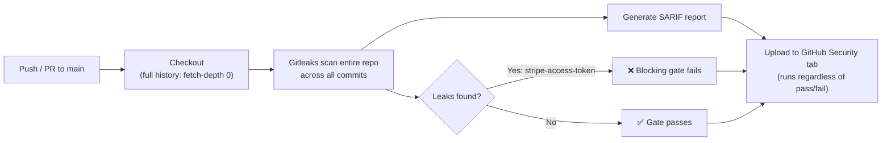

# Secrets Detection Gate Implementation Plan

> **For agentic workers:** REQUIRED SUB-SKILL: Use superpowers:subagent-driven-development (recommended) or superpowers:executing-plans to implement this plan task-by-task. Steps use checkbox (`- [ ]`) syntax for tracking.

**Goal:** Add a second GitHub Actions security gate that runs Gitleaks across the repo's full git history, blocking the build on any leaked credential and publishing findings to GitHub's Security tab — reusing the existing seeded secret in `sample-app/src/config.ts` as the demo finding.

**Architecture:** A new `.github/workflows/secrets-scan.yml` workflow runs inside the pinned `zricethezav/gitleaks:v8.30.1` container, checks out full git history (`fetch-depth: 0`), runs `gitleaks git .` against the whole repo (not just `sample-app/`) as the blocking gate, then regenerates a SARIF report (forced `--exit-code 0` so this step can't itself fail) and uploads it via `github/codeql-action/upload-sarif@v3`, mirroring `sast.yml`'s structure exactly. No application code changes — the existing fabricated Stripe-shaped key in `config.ts` is already caught by Gitleaks' default `stripe-access-token` rule (verified locally).

**Tech Stack:** GitHub Actions, Gitleaks (secrets scanning), Docker (`zricethezav/gitleaks:v8.30.1`).

**Spec:** `docs/superpowers/specs/2026-08-30-secrets-detection-gate-design.md`

## Global Constraints

- No new fabricated secrets — reuse the existing seeded credential in `sample-app/src/config.ts` (per spec's Non-goals). Never quote that literal value in any other file (a prior commit, `581cc3a`, hit GitHub push protection for exactly this — a second copy of the same secret string in a doc file).
- No `.gitleaks.toml` or `.gitleaksignore` — the default ruleset already catches the seeded secret; nothing needs suppressing (per spec's Non-goals).
- Scan the whole repo, not just `sample-app/` — secrets can leak anywhere (per spec's Goals).
- CI on `main` is expected to fail once this workflow is live — this is correct behavior, not a bug to chase (mirrors the SAST gate).
- The repo (`git@github.com:jgyy/devsecops.git`) is public — SARIF→Security tab upload relies on that for free code scanning.
- `git push` (or any action touching the GitHub remote) requires explicit user confirmation before running — never push automatically, even mid-plan.

---

### Task 1: Add the GitHub Actions secrets-scan workflow

**Files:**
- Create: `.github/workflows/secrets-scan.yml`

**Interfaces:**
- Consumes: the whole repo (all tracked files, full git history) as the scan target — no dependency on any other task's output.

- [ ] **Step 1: Sanity-check Gitleaks locally against this repo**

Run from the repo root:
```bash
docker run --rm -v "$(pwd)":/repo -w /repo zricethezav/gitleaks:v8.30.1 git . --no-banner
```
Expected: exit code `1`, log line `leaks found: 1`, with the finding's `RuleID` reported as `stripe-access-token` and `File` as `sample-app/src/config.ts`. (Already verified during design/planning — this step is a repeatable sanity check, not new discovery.)

- [ ] **Step 2: Create `.github/workflows/secrets-scan.yml`**

```yaml
name: Secrets Detection Gate

on:
  push:
    branches: [main]
  pull_request:
    branches: [main]
  workflow_dispatch:

permissions:
  contents: read
  security-events: write

jobs:
  gitleaks:
    name: Gitleaks secrets scan
    runs-on: ubuntu-latest
    container:
      image: zricethezav/gitleaks:v8.30.1
    steps:
      - name: Checkout (full history)
        uses: actions/checkout@v4
        with:
          fetch-depth: 0

      - name: Run Gitleaks (blocking gate)
        run: |
          gitleaks git . --no-banner

      - name: Generate SARIF for Security tab
        if: always()
        run: |
          gitleaks git . --no-banner \
            --report-format sarif \
            --report-path gitleaks-results.sarif \
            --exit-code 0

      - name: Upload SARIF to GitHub Security tab
        if: always() && (github.event_name != 'pull_request' || github.event.pull_request.head.repo.full_name == github.repository)
        uses: github/codeql-action/upload-sarif@v3
        with:
          sarif_file: gitleaks-results.sarif
```

> **Note (added post-implementation):** the first live run of this workflow
> silently passed with "0 commits scanned" instead of failing on the
> seeded secret. Root cause: inside a `container:` job, `actions/checkout`
> registers its `safe.directory` git exception under a temporary `HOME` it
> only uses for its own internal git calls — that exception never reaches
> the container's real `HOME`, which subsequent `run:` steps use. Gitleaks
> shells out to `git log` internally, hit git's dubious-ownership check as
> a result, and treated the failure as "no leaks" rather than erroring —
> a silent gate bypass. Fixed by adding a
> `git config --global --add safe.directory "$GITHUB_WORKSPACE"` step
> between checkout and the Gitleaks steps.
>
> A second gap was caught by an automated post-push security review:
> Gitleaks honors inline `// gitleaks:allow` comments by default, so a PR
> could pair a real secret with that comment and the gate would silently
> pass it. Fixed by adding `--ignore-gitleaks-allow` to both Gitleaks
> invocations. See the actual shipped `.github/workflows/secrets-scan.yml`
> for the current version, and the spec's Revisions section for the full
> writeup of both gaps.

- [ ] **Step 3: Validate the workflow YAML syntax**

Run: `python3 -c "import yaml; yaml.safe_load(open('.github/workflows/secrets-scan.yml')); print('valid')"`
Expected: prints `valid` with no exception.

- [ ] **Step 4: Commit**

```bash
git add .github/workflows/secrets-scan.yml
git commit -m "feat: add Gitleaks secrets detection GitHub Actions workflow"
```

---

### Task 2: Document the feature in the README

**Files:**
- Modify: `README.md`

**Interfaces:**
- Consumes: `.github/workflows/secrets-scan.yml` (Task 1) as the linked pipeline file.

- [ ] **Step 1: Replace the SAST section's closing line and expected-fail framing**

Read `README.md` first, then use Edit to replace:
```
Because of this, **CI on `main` is expected to fail** — that's the point. It proves the security gate actually blocks insecure code rather than silently logging it. Check the failed [Actions run](../../actions) for Semgrep's annotated findings, or the [Security tab](../../security/code-scanning) for the same findings published as GitHub code scanning alerts (SARIF).

#### Running it locally

```bash
cd sample-app
npm install
npm test          # runs the app's own test suite (vitest)
pipx install semgrep   # if you don't already have it (or: pip install --user semgrep)
semgrep scan . --config=p/default
```

_More features (CI/CD pipelines, IaC, containers, additional scanners) will be added here as this repo grows._
```
with:
```
Because of this, **CI on `main` is expected to fail** — that's the point. It proves the security gate actually blocks insecure code rather than silently logging it. Check the failed [Actions run](../../actions) for Semgrep's annotated findings, or the [Security tab](../../security/code-scanning) for the same findings published as GitHub code scanning alerts (SARIF).

#### Running it locally

```bash
cd sample-app
npm install
npm test          # runs the app's own test suite (vitest)
pipx install semgrep   # if you don't already have it (or: pip install --user semgrep)
semgrep scan . --config=p/default
```

### 2. Secrets Detection Gate

A second GitHub Actions pipeline ([`.github/workflows/secrets-scan.yml`](.github/workflows/secrets-scan.yml)) runs [Gitleaks](https://github.com/gitleaks/gitleaks) across the repo's **full git history** — not just the current files — on every push to `main` and every pull request. This catches a class of leak the SAST gate can't: a credential that was committed and later deleted or rotated still shows up, because Gitleaks scans every commit's diff, not just the working tree at HEAD.



**Note:** this reuses the same seeded credential the SAST gate already catches — no second fake secret was added. It doubles as a demonstration that one intentional vulnerability can be (and, in a real pipeline, should be) caught by more than one class of tool:

| File | Vulnerability | Detected by |
|---|---|---|
| `sample-app/src/config.ts` | Hardcoded Stripe-shaped credential (CWE-798) | Gitleaks `stripe-access-token` rule |

Because of this, **CI on `main` is expected to fail for both gates** — that's the point of this repo. Check the failed [Actions runs](../../actions) for either pipeline's annotated findings, or the [Security tab](../../security/code-scanning) for the combined findings from both, published as GitHub code scanning alerts (SARIF).

#### Running it locally

```bash
docker run --rm -v "$(pwd)":/repo -w /repo zricethezav/gitleaks:v8.30.1 git .
```

_More features (CI/CD pipelines, IaC, containers, additional scanners) will be added here as this repo grows._
```

- [ ] **Step 2: Commit**

```bash
git add README.md
git commit -m "docs: document the secrets detection gate feature"
```

---

### Task 3: Push and verify against live GitHub Actions

**Files:** none (no code changes — verification only)

- [ ] **Step 1: STOP — get explicit user confirmation**

Before running any `git push`, ask the user to explicitly confirm they want to push these commits to `git@github.com:jgyy/devsecops.git`. Do not proceed to Step 2 without an explicit yes — this pushes to the shared remote and triggers a real (expected-to-fail) CI run visible to anyone with repo access.

- [ ] **Step 2: Push**

```bash
git push origin main
```

- [ ] **Step 3: Verify the workflow ran and behaved as designed**

Check the repo's Actions tab: confirm the `Secrets Detection Gate` workflow ran, and that it failed with the Gitleaks finding annotated (rule `stripe-access-token`, file `sample-app/src/config.ts`). Check the Security → Code scanning alerts tab: confirm the finding appears there via the SARIF upload, alongside the SAST gate's three findings.

- [ ] **Step 4: Report back**

Summarize to the user: workflow run URL, pass/fail state (expected: fail), and confirmation that the finding appears in the Security tab. No commit needed — this task is verification only.
